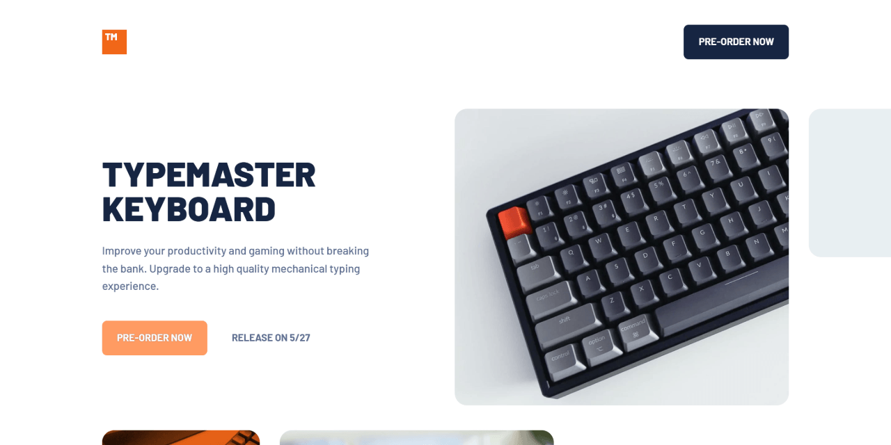
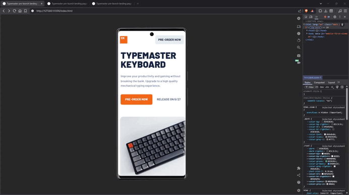

# 🚀 Typemaster pre-launch landing page

A responsive landing page built with a mobile-first approach using semantic HTML and modern CSS.

This project focuses on layout composition, reusable utility classes (`stack` and `cluster`), CSS Layers for architecture, and design tokens for consistent styling. It also includes custom handling of overflowing images and decorative patterns across breakpoints.

This is a solution to the [Typemaster pre-launch landing page challenge on Frontend Mentor](https://www.frontendmentor.io/challenges/typemaster-prelaunch-landing-page-J6-Yj5J-X).

---

## 🔗 Links

- 🌎 [Live site](https://vimpdev.github.io/fem-junior-htmlcss-04-typemaster-landing-page/)
<!-- - 📌 [Frontend Mentor solution]() -->

---

## 🎬 Demo

---

## 📸 Screenshots

| 🖥️ Desktop | 🖱️ Hover | 🎯 Focus |
| --- | --- | --- |
|  |  |  |
| 📱 Mobile | 📲 Tablet |
| --- | --- |
|  |  |

---

## 🎯 The challenge

Users should be able to:

- View the optimal layout depending on their device's screen size
- See hover states for interactive elements

---

## 🛠️ Built with

- Semantic HTML5
- CSS custom properties (design tokens)
- CSS Layers (`@layer`)
- Flexbox & Grid
- Mobile-first workflow
- Reusable utility classes (`stack`, `cluster`)

---

## ✨ Key Features

- Mobile-first responsive layout
- Reusable layout utilities (`stack` and `cluster`)
- CSS Layers for scalable architecture
- Design tokens for spacing, colors, and typography
- Decorative patterns positioned with pseudo-elements
- Custom image overflow handling outside container bounds
- Accessible focus states using `:focus-visible`

---

## 📚 What I learned

- How to structure CSS using `@layer` for better scalability and separation of concerns
- Managing complex layouts with overflowing elements without breaking alignment
- When and how to use utility classes like `stack` and `cluster`
- Handling decorative elements using pseudo-elements instead of extra markup
- Improving accessibility with proper focus states and semantic HTML

---

## 🤖 AI Collaboration

I used AI tools as a support resource during development.

- Debug layout issues (image overflow, positioning)
- Validate CSS architecture decisions
- Improve accessibility and semantics

I mainly used it to better understand concepts and validate my approach.

---

## 👩‍💻 Author

- Frontend Mentor – [@vimpdev](https://www.frontendmentor.io/profile/vimpdev)

---